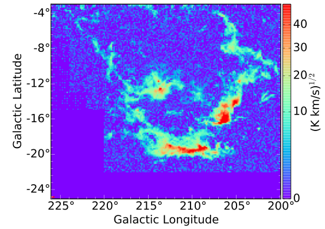
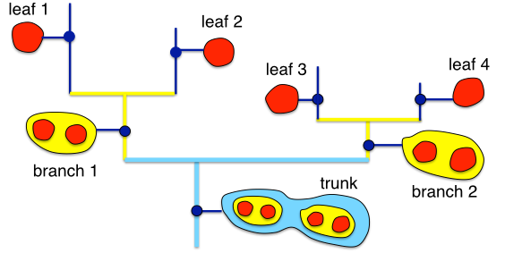
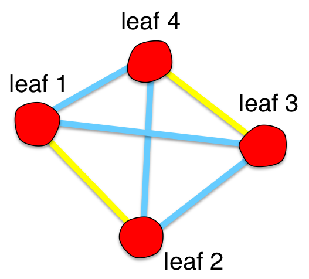
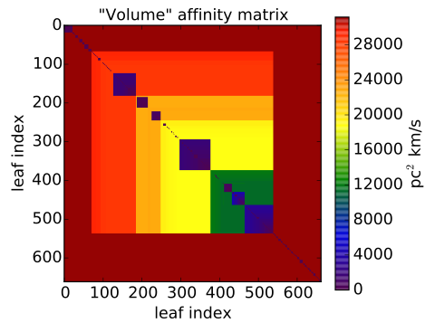
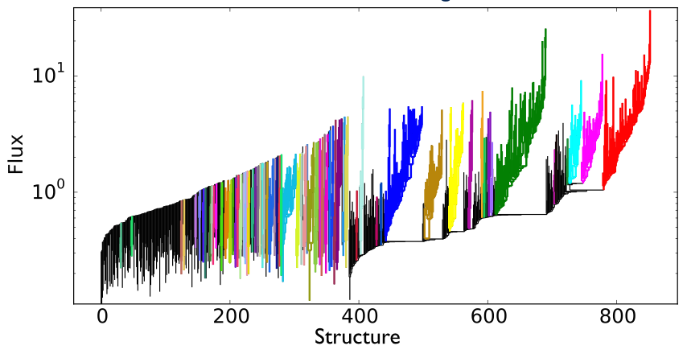

The concepts behind the algorithm
=========================================
This guide provides an intuitive description of the steps followed 
by ``SCIMES`` to identify structures within a dataset. 
The full formalism is reported in <SCIMES paper link>.

Which dataset to use?
---------------------

``SCIMES`` can be applied to *position-position-velocity* (PPV) data cubes, *position-position-position* simulations or *position-position* images. For this example we use the PPV data cube of
the Orion-Monoceros complex imaged in 12CO(1-0) by 
`Wilson et al. 2005, A&A, 430, 523W <http://adsabs.harvard.edu/abs/2005A%26A...430..523W>`_ whose presents a spatial and spectral resolution of ~ 1 pc (at an average distance to the complex of 450 pc) and 0.65 km/s, respectively. The figure shows the square-root of the integrated intensity map of the dataset.

Building the dendrogram
------------------------

A dendrogram is a tree that represents the hierarchical structure in the data (`Rosolowsky et al. 2008, ApJ, 679, 1338R <http://adsabs.harvard.edu/abs/2008ApJ...679.1338R>`_; see also the description for the `astrodendro algorithm core <https://dendrograms.readthedocs.org/en/latest/algorithm.html>`_). It is composed of two types of structures: *branches*, which are structures which split into multiple sub-structures, and *leaves*, which are structures that have no sub-structure (i.e. local maxima). The *trunk* is a super-structure that has no parent structure, and contains all other structures. In the Orion-Monoceros dataset, branches represent potential Giant Molecular Clouds (GMCs), leaves are essentially clumps within the GMCs, and the trunk can be considered as the full star forming complex. In the figure, stronger connection between the leaves are indicated with yellow lines, while weaker with cyan lines.

A *dendrogram* as a *graph*
---------------------------

How can we identify relevant objects within the dendrogram? We need first to abstract the dendrogram as a `graph <https://en.wikipedia.org/wiki/Graph_(mathematics)>`_.
A graph is a collection of objects (*nodes*) which possess certain relations. These relations are represented by *edges* between the *nodes* whose weight indicate the strength of the relations. A dendrogram can be abstract into a graph by considering the “leaves” as graph “nodes”. Every leaf is connected to another leaf in the dendrogram at a given hierarchical level. “Edges” are represented by the highest structure of the dendrogram that contains the two leaves considered. The figure follows the same color convention as the previous one. 

From the *graph* to the *affinity matrix*
-----------------------------------------

Each edge weight can be collected into an affinity matrix. In a PPV cube, edges
are 3D structures (isosurfaces) that possess several physical properties. We
define an edge weight (or affinity) as the inverse of a certain isosurface
property.  In this case we use the "PPV volume", defined as the product between
the area from the effective radius and the velocity dispersion of the
isosurfaces. The larger the volume, the lower the affinity, and the lower the
possibility for two clumps to belong to same cloud. By default, ``SCIMES``
performs the segmentation based on the "volume", "flux", or an aggregate
version of the two matrices. These properties can also be defined by their
physical version once distances are provided. 

Cutting the graph through the *Spectral Clustering*
---------------------------------------------------

.. image:: figures/spectclust.png
   :align: center

The `Spectral Clustering <http://scikit-learn.org/stable/modules/clustering.html#spectral-clustering>`_ approach translates the ISM property encoded within the matrix into a Euclidean space where the clustering properties of the dendrogram are enhanced. To do this the first *k* eigenvectors of the affinity matrix are defined (spectral embedding). *k* defines also the dimensionality of the clustering space and the number of clusters to search. Afterwards, ``SCIMES`` automatically finds the best arrangement of leaves into clusters and the best number of clusters, i.e. GMCs. In the figure, a concentric distribution of objects is shown. Objects with the same color have higher affinity (i.e. their connection is stronger). However they cannot be clustered using a Euclidean distance-based algorithm. The spectral clustering transforms all affinity information to the clustering space via spectral embedding of the affinity matrix.

*Clustered* dendrogram
-----------------------

   
The figure shows the final product of ``SCIMES``: the *clustered* dendrogram. Each color indicates a relevant branch (i.e. *cluster*) within the dendrogram, according to the chosen affinity criterion. In this case, the clusters are selected based on their similar maximal volume. Affinity criteria can be based upon virtually any observable property of the ISM.

Giant Molecular Clouds in Orion-Monoceros
-----------------------------------------

.. image:: figures/orion_clust.png
   :align: center
   
The relevant branches of the Orion-Monoceros associated dendrogram correspond to the notable GMCs of the complex: *Orion A* (red), *Orion B* (green), *Monoceros* (magenta), the *Northern Filament* (blue), NGC2149 (cyan), the *Crossbones* (yellow), the *Scissors* (purple). ``SCIMES`` correctly identifies them without over-dividing the molecular emission.
