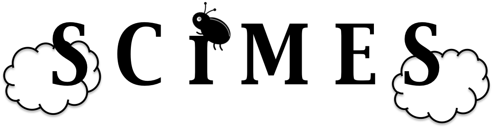

Spectral Clustering for Molecular Emission Segmentation
=======================================================

``SCIMES`` idenfifies relevant molecular gas structures within
dendrograms of emission using the spectral clustering paradigm.
``SCIMES`` is useful to decompose objects in complex
enviroments imaged at high resolution.  

Documentation
-------------

.. toctree::
   :maxdepth: 2

   installation.rst
   algorithm.rst
   tutorial.rst
   

Reporting issues and getting help
---------------------------------

Please help us improve this package by reporting issues via `GitHub
<https://github.com/Astroua/SCIMES/issues>`_. You can also open an
issue if you need help with using the package.

Developers
----------

This package is developed by:

* [Dario Colombo](https://github.com/dcolombo)
* [Erik Rosolowsky](https://github.com/low-sky)
* [Adam Ginsburg](https://github.com/keflavich)
* [Ana Duarte-Cabral](https://github.com/anacabral)
* [Annie Hughes](Annie.Hughes@irap.omp.eu)

Citing SCIMES
------------------

If you make use of this package in a publication, please consider adding the
following acknowledgment:

*This research made use of SCIMES, a Python package to find relevant structures
into dendrograms of molecular gas emission using the spectral clustering approach* 
or the related paper.

``SCIMES`` is an astropy affiliated-package. Please also consider adding 
an acknowledgment for Astropy (see
`<http://www.astropy.org>`_ for the latest recommended citation).

Public API
----------

.. toctree::
   :maxdepth: 1
