``SCIMES`` tutorial
===================

In this tutorial we will show the steps necessary to obtain the segmentation of
the Orion-Monoceros dataset (`orion_12CO.fits
<https://www.cfa.harvard.edu/rtdc/CO/NumberedRegions/DHT27/index.html>`_)
presented in the ``SCIMES`` paper. Most of this tutorial is collected in the
script `orion2scimes.py
<https://github.com/Astroua/SCIMES/blob/master/scimes/orion2scimes.py>`_.

Building the dendrogram and the structure catalog
-------------------------------------------------
First, we need to compute the dendrogram and its related catalog,
i.e. the inputs of  ``SCIMES``. In this example we are dealing with 
real observations. Therefore, we have to open a FITS file by using,
for example, ``astropy`` :

    >>> from astropy.io import fits
    >>> hdu = fits.getdata('orion_12CO.fits')[0]
    >>> data = hdu.data
    >>> hd = hdu.header

Afterward the dendrogram can be computed:

    >>> from astrodendro import Dendrogram
    >>> d = Dendrogram.compute(data)

the astrodendro.dendrogram.Dendrogram class has various tuning 
parameters. To explore them and their meaning, please refer to:
`Computing and exploring dendrograms <https://dendrograms.readthedocs.org/en/latest/using.html>`_.

The dendrogram of Orion-Monoceros can be simply obtained using the following parameters:

    >>> sigma = 0.3 #K, noise level
    >>> ppb = 1.3 #pixels/beam
    >>> from astrodendro import Dendrogram
    >>> d = Dendrogram.compute(data, min_value=sigma, min_delta=2*sigma, min_npix=3*ppb)

and it looks like:

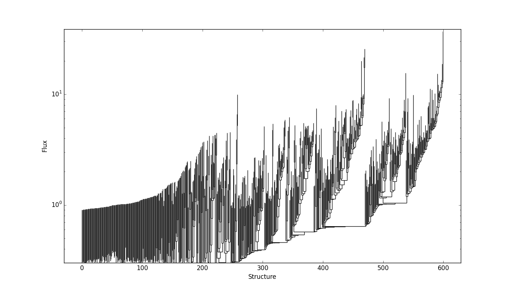

``SCIMES`` applies the spectral clustering based on the properties of
all structures within the dendrogram. The dendrogram catalog
can be obtained by the `ppv_catalog() <https://dendrograms.readthedocs.org/en/latest/api/astrodendro.analysis.html#astrodendro.analysis.ppv_catalog>`_ or `pp_catalog() <https://dendrograms.readthedocs.org/en/latest/api/astrodendro.analysis.html#astrodendro.analysis.pp_catalog>`_ functions, for example:

    >>> from astrodendro import ppv_catalog
    >>> from astropy import units as u
    >>> metadata = {}
    >>> metadata['data_unit'] = u.Jy
    >>> cat = ppv_catalog(d, metadata)

Further information about the dendrogram catalog functions can be found here: `Making a catalog <https://dendrograms.readthedocs.org/en/latest/catalog.html#making-a-catalog>`_.

Clustering the dendrogram
-------------------------
The clustering of the dendrogram is obtained through the 
:class:`~scimes.SpectralCloudstering` class which requires as inputs
the dendrogram and its related catalog:

    >>> from scimes import SpectralCloudstering
    >>> dclust = SpectralCloudstering(d, cat)

By default, the clustering is performed on the aggregate affinity matrix given by
the `element-wise multiplication of the luminosity and the volume
matrix <http://scimes.readthedocs.org/en/latest/algorithm.html#from-the-graph-to-the-affinity-matrix>`_.  If instead you want
to perform the clustering based on volume only, ignoring luminosity, this can be achieved by setting:  

    >>> dclust = SpectralCloudstering(d, cat, criteria = ['volume'])

or if only the luminosity matrix is needed:

    >>> dclust = SpectralCloudstering(d, cat, criteria = ['luminosity'])

The :class:`~scimes.SpectralCloudstering` class provides several
optional inputs:

* ``criteria``: the criteria used to cluster the dendrogram. The names
  listed must correspond to structure properties present in the catalog.
  The user can provide as many criteria as needed, ``SCIMES`` will
  generate affinity matrices for each of them and the aggregate
  matrix for the final clustering.

* ``user_k``: the number of clusters expected can be provided as an
  input. In this case, ``SCIMES`` will not make any attempt to guess
  it from the affinity matrix.

* ``user_ams``: if clustering based on a different property than
  volume and luminosity is wanted, this can be obtained by providing a
  user defined affinity matrix. This matrix needs to be ordered according to
  the dendrogram leaves indexing. Several matrices based on various
  properties can be provided all together; ``SCIMES`` aggregates them
  and generates the clustering based on all these properties.

* ``user_scalpars``: the scaling parameters of the affinity matrices
  can be provided as input. The scaling parameters are used to suppress
  some affinity values of the matrix and enhance others by
  rescaling the matrices with a Gaussian kernel. Also, this operation
  normalizes the matrices and prompts the user whether the matrices should be aggregated
  or this step should be skipped, proceeding directly to the clustering. The choice of the scaling parameters
  might influence the final result. If not provided, ``SCIMES``
  estimates them directly from the affinity matrices.

* ``user_iter``: number of k-means iterations to be performed. By default,
  ``user_iter = 100``. This value can be increased, increasing the
  k-means stability and the computation time.

* ``rms``: the noise level of the observation. If provided,
  ``SCIMES`` calculates the scaling parameter above a certain 
  signal-to-noise ratio threshold within the dendrogram. 
  The threshold expressed is expressed as ``s2nlim*rms``. 
  ``s2nlim`` is set by default to 3, but it can also by provided as
  input. THIS IS A STRONGLY RECOMMENED INPUT SINCE IT INCREASES 
  THE STABILITY OF THE CODE.

* ``savesingles``: by definition single leaves do not form clusters,
  since clusters are constituted by at least two objects. Therefore, they
  are eliminated by default from the final cluster counts. For some
  applications, as in case of low resolution observations,
  single leaves might represent relevant entities that need to be
  retained. This keyword forces ``SCIMES`` to consider unclustered and
  isolated leaves as independent clusters that will appear in the
  final cluster index catalog.
 
* ``keepall``: when a cluster of leaves cannot be attributed to a single
  isolated branch containing only the leaves of the cluster, the cluster
  leaves are pruned until this condition is satisfied. The final branch 
  representing the cluster will have the larger amout of leaves of the 
  selected cluster. During this operation several isolated branches within
  the same cluster might result unassignible. By triggering ``keepall``,
  those branches are retained and assigned to separed objects.

As an example, we run  ``SpectralCloudstering`` on the Orion-Monoceros
dataset, using the "volume" matrix only without including distance
information. In this case ``SCIMES`` prints:

    >>> Running SCIMES
    >>> WARNING: adding luminosity = flux to the catalog.
    >>> WARNING: adding volume = pi * radius^2 * v_rms to the catalog.
    >>> WARNING: clustering will be performed on the Volume matrix only

The first two WARNINGs are related to the fact that in the original
implementation of the ppv_catalog(), "volume" and "luminosity" are not
present. ``SCIMES`` calculates them using the properties within the
catalog and adds them to the catalog. The third WARNING relates to the
fact that the clustering will be performed only on the "volume" matrix.

Firstly, ``SCIMES`` proceeds to calculate the affinity matrices:

    >>> - Creating affinity matrices

If the keyword ``blind == False`` the affinity matrices are visualized:

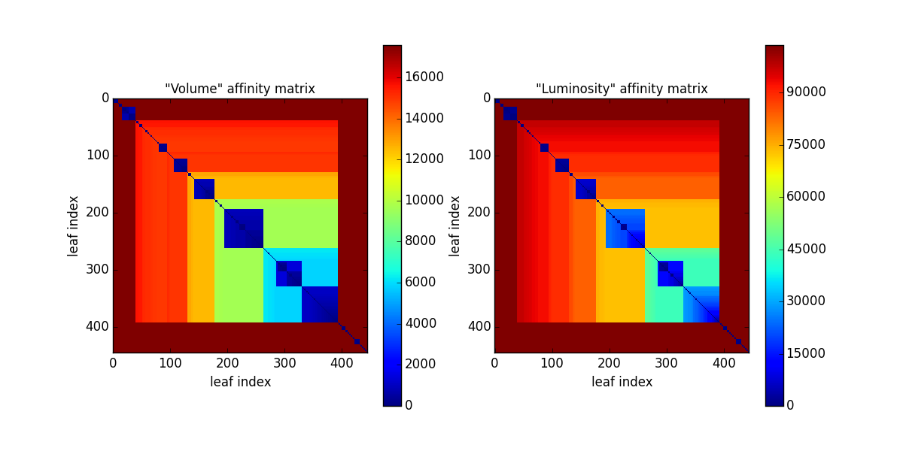

Then the spectral clustering starts. Only the "volume" matrix (matrix
0) is rescaled. The estimated scaling parameter is shown.

    >>> - Start spectral clustering
    >>> -- Smoothing  0  matrix
    >>> -- Estimated scaling parameter: 3643.23718741

Afterwards, if ``blind == False``, the rescaled matrix is also
visualized:

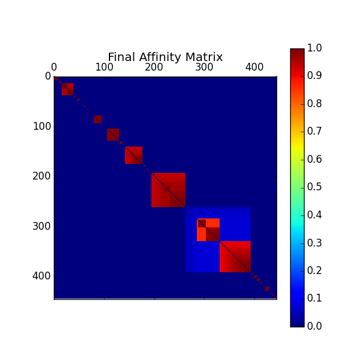

In the case whose the "luminosity" clustering criterion is also
selected, the final matrix is the product of the rescaled "volume" and
"luminosity" matrices. 

The number of cluster to find is first guessed from the number of
blocks present along the main diagonal of the final affinity matrix.
This number is further optimazed by calculating the value of the
"silhouette" (see next Section) for 30 clustering configurations around the guessed value.
The "silhouette" value of the best configuration is also printed.

    >>> -- Guessed number of clusters = 42
    >>> -- Best cluster number found through SILHOUETTE ( 0.985594230523 )=  43

At this point the spectral clustering finds the best assessment of
dendrogram leaves within 43 clusters. However, some clusters cannot 
be assigned to specific branches within the dendrogram and they 
are eliminated from the final cluster counts; the cluster number 2 and
13 are considered "unassignable". This operation is called "cluster cleaning".

    >>> -- Unassignable cluster  2
    >>> -- Unassignable cluster  13

The final number of clusters for the Orion-Monoceros dendrogram using the
"volume" criterion is 41:

    >>> -- Final cluster number (after cleaning) 41

Clustering results
------------------
The main output of the algorithm, ``clusters``, is a list of dendrogram
indices representing the relevant structures within the dendrogram according
to the scale of the observation and the affinity criteria used. In the
case of Orion-Monoceros, the properties of the structures are the
equivalent to "Giant Molecular Clouds". Those structures are already
present in the dendrogram. The hierarchy can be accessed
following the instructions on the `astrodendro documentation page  <https://dendrograms.readthedocs.org/en/latest/using.html#exploring-the-dendrogram>`_,
while their properties and statistics are collected in the dendrogram `pp <https://dendrograms.readthedocs.org/en/latest/api/astrodendro.analysis.html#astrodendro.analysis.PPStatistic>`_ or `ppv <https://dendrograms.readthedocs.org/en/latest/api/astrodendro.analysis.html#astrodendro.analysis.PPVStatistic>`_ catalog.
``SCIMES`` provides other outputs that result from the
clustering analysis:

* ``affmats``: numpy arrays containing the affinity matrices produced
  by the algorithm or provided as inputs by the user. The indices of
  those matrices represent the ``leaves`` of the dendrogram permuted
  in order to make the possible matrix block structure emerge. The
  permutation, however, does not influence the following spectral embedding.

* ``escalpars``: list containing the estimated scale parameters
  from the clustering analysis associated with the different input affinity
  matrices. Scaling parameters represent maximal properties (by
  default ``volume`` and ``luminosity``, or ``flux``) that the final
  structures tend to have.

* ``silhouette``: float showing the silhouette of the selected
  clustering configuration. This value ranges between 0 and 1 and
  represents the goodness of the clustering, where values close to 0
  indicate poor clustering, while values close to 1 indicate well
  separated clusters (i.e. good clustering)

``SCIMES`` visualizes the clusters within the dendrogram throught the 
`plot_tree <https://dendrograms.readthedocs.org/en/latest/api/astrodendro.plot.DendrogramPlotter.html#astrodendro.plot.DendrogramPlotter.plot_tree>`_ method of ``astrodendro``. Each cluster is indicated
with a different random color. Following the example in the previous
Section, this can be done through:

    >>> dclust.showdendro()

The result for the Orion-Monoceros dendrogram is:

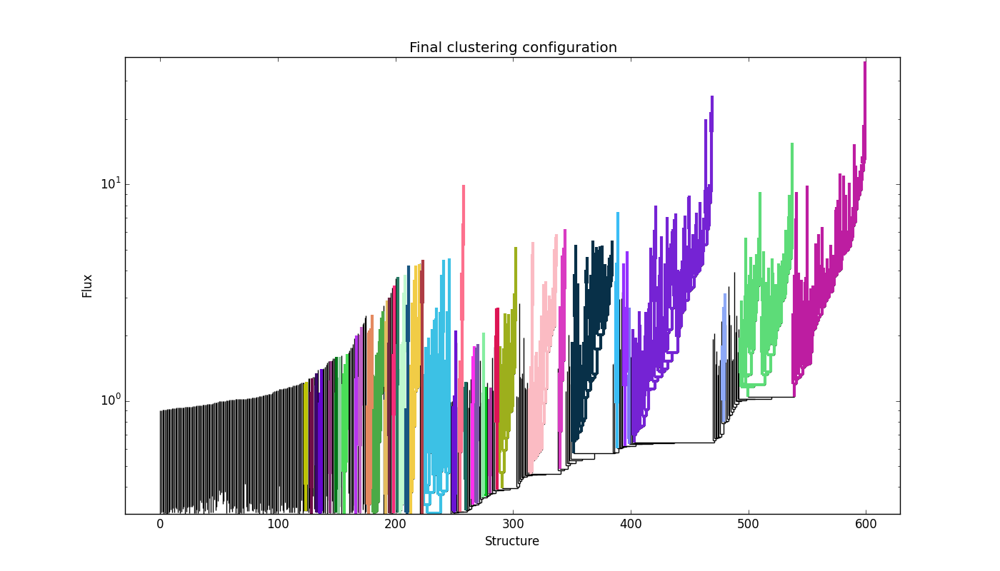

where each color indicates a single cluster/relevant object within the
dendrogram.

Together, ``SCIMES`` generates the assignment cube of the clouds
through the `get_mask
<https://dendrograms.readthedocs.org/en/latest/api/astrodendro.structure.Structure.html#astrodendro.structure.Structure.get_mask>`_
method of ``astrodendro``.  Pixels within a given cloud are labeled
with a number related to the index of the dendrogram. This can be
obtained by doing:

    >>> dclust.asgncube(hd)

where ``hd`` is the FITS file header of the Orion-Monoceros
dataset. The unassigned pixels are labelled with -1.
If the keyword ``collapse == True``, a collapsed version of
the PPV assigment cube is visualized:

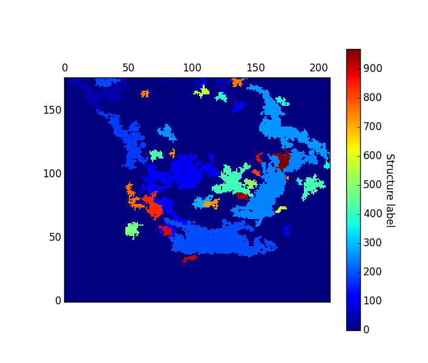

A nice representation of the decomposed objects might be obtained by
using `APLpy <https://aplpy.github.io/>`_:

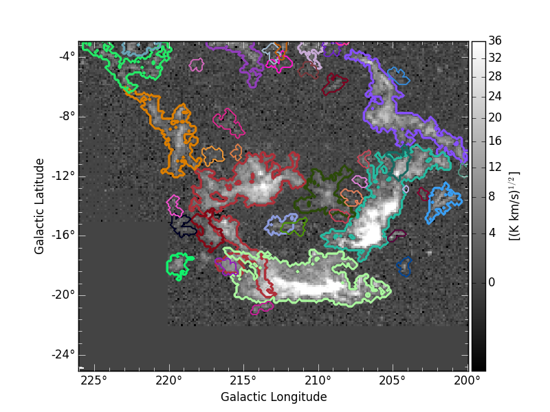

where the integrated intensity map can be downloaded from `orion_12CO_mom0.fits
<https://www.cfa.harvard.edu/rtdc/CO/NumberedRegions/DHT27/index.html>`_.

Difference between pixel and physical property-based segmentation
-----------------------------------------------------------------
The above segmentation of the Orion-Monoceros dataset has been obtain
using pixel-based properties. Nevertheless, if distances are know
those can be attributed to every structrure within the dendrogram in
order to provide segmentations based on the physical properties of the
structures. By doing that, the "volume" criterion assume the units pc2
km/s. The objects obtained in this way are very similar to the ones
decomposed using the pixel-based "volume". Nevertheless, NGC2149 and
Monoceros are separated:

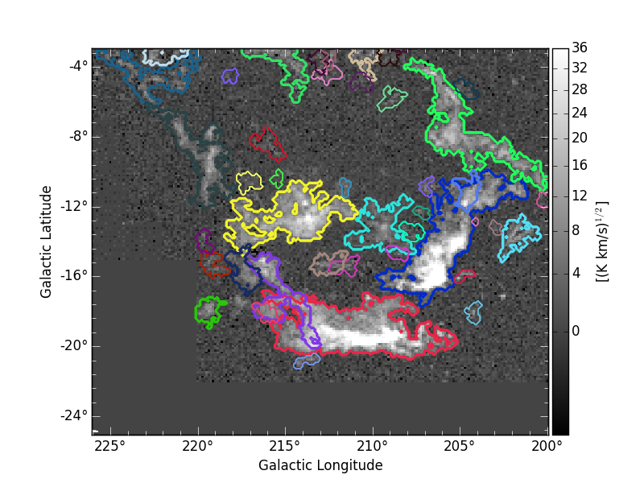

Affinity matrix choice
----------------------
By default ``SCIMES`` deals with the "volume" and "luminosity"
matrices. Nevertheless, every affinity matrix can be provided by the
user in order to obtain segmentation based on the desired property of
the ISM. This operation is generally made through the ``user_ams`` keyword.
However, ``SCIMES`` works well with monotonic and block
diagonal matrices, and might misbehave when non-monotonic and strictly
continous criteria are provided. In this example we show the
segmentation of the Orion-Monoceros dataset using the "velocity
dispersion" of the structures. The full run of ``SCIMES`` provides:

    >>> - Creating affinity matrices
    >>> - Start spectral clustering
    >>> -- Rescaling  0  matrix
    >>> -- Estimated scaling parameter: 2.0795701609
    >>> -- Guessed number of clusters = 49
    >>> -- Best cluster number found through SILHOUETTE ( 0.783614320248 )=  59
    >>> -- Final cluster number (after cleaning) 66

In particular, the decomposed structures of the Orion-Monoceros
dataset have a characteristic "velocity dispersion" of 2
km/s. However, the silhouette (~0.78) is not very high indicating a
not optical clustering for this criteria. Moreover, the block in the
affinity matrix are not well defined:

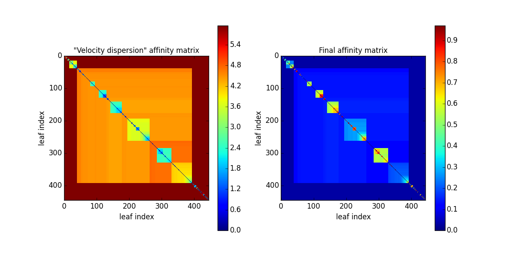

and the dendrogram branches appear overdivided:

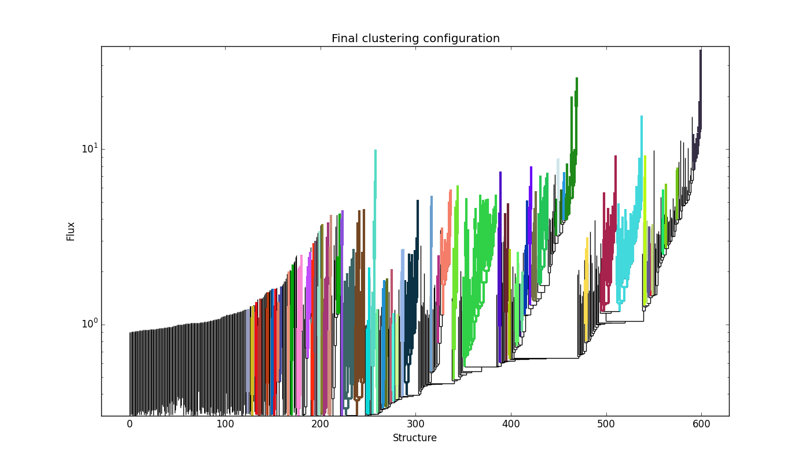

providing:

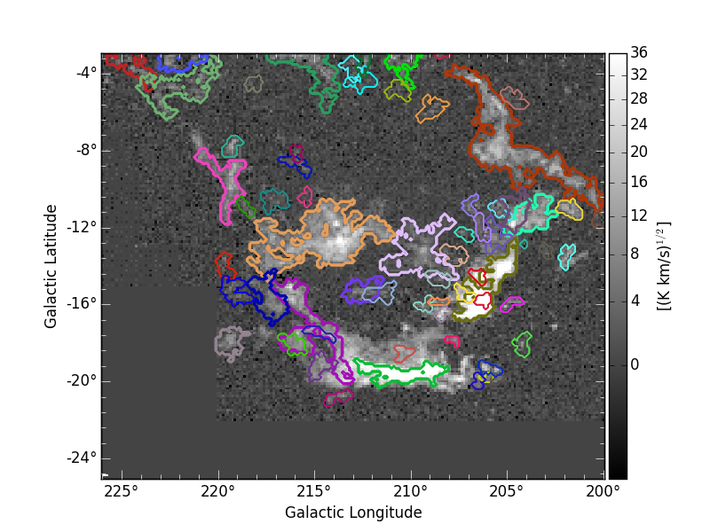

This indicates that the structures in Orion-Monoceros are not highly
separated along the line of sight and that, in general, the velocity
dispersion is not a good criterion for this dataset.

``SCIMES`` behaviour at low resolution
--------------------------------------
``SCIMES`` is designed to find well resolved objects, constituted by
several resolution elements. Nevertheless, it might be applied also to low
resolution observations. In this case the code essentially behaves as 
a "clump-finder". When working at low resolution, the ``savesingles``
keyword might be necessary, though (see above). In this example, the
Orion-Monoceros dataset has been smoothed to a resolution of 10 pc
(i.e. approximately a factor 10 lower than the original
resolution). The following image show the result of ``SCIMES`` run.

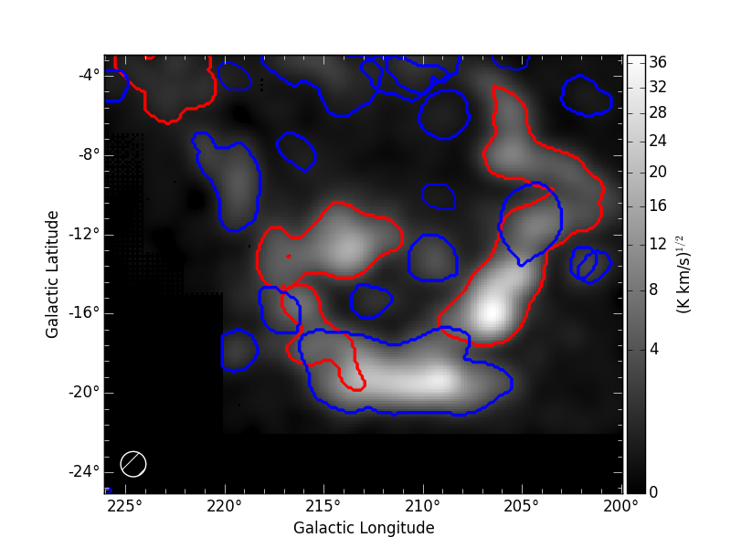
 
Red contours indicate objects that have been decomposed by ``SCIMES``
using the default settings. Blue contours indicates, instead, the
additional objects retained by enabling the ``savesingles``
keyword. This keyword forced ``SCIMES`` to keep single leaves in the
final cluster catalog, and allow to decomposed some notable clouds (as
Monoceros, the Crossbones, and the Scissor) that at this resolution
are constituted by a single leaf, therefore erased by default. 
